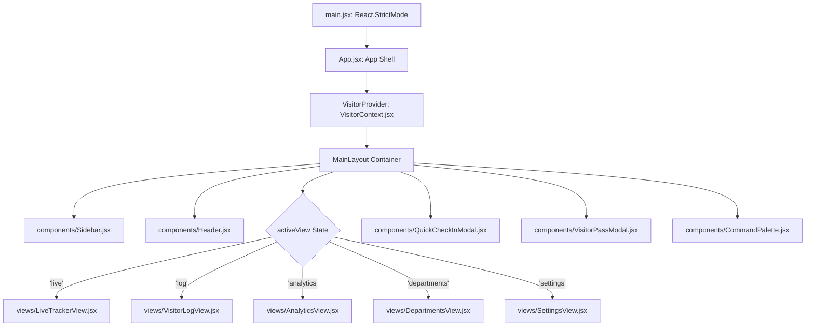

# Frontend Architecture, Component Tree & UX Flow Analysis
**Project**: VSMS PRO — Computerized Guest Information Tracking System  
**Survey Date**: 2026-08-18  
**Investigator**: Explorer 1 (Frontend Architecture & UX Survey)  
**Target Milestone**: Redesign into High-Contrast Ultra-Minimalist Black & White Monochrome Interface

---

## 1. System Overview & Technology Stack

| Layer | Technology / Library | Version / Details | Purpose |
|---|---|---|---|
| **Core Framework** | React + ReactDOM | `18.3.1` | Single-page component application |
| **Build & Dev Tooling** | Vite | `6.0.7` (`v6.4.3` runner) | Fast ESM compilation & production bundling |
| **Styling & Design** | Tailwind CSS + PostCSS + Autoprefixer | `3.4.17` | Utility-first styling with dark/light mode classes |
| **Icons** | Lucide React | `0.469.0` | Comprehensive vector UI iconography |
| **QR Code Generation** | `qrcode.react` (`QRCodeSVG`) | `4.2.0` | Digital visitor badge pass QR generation |
| **Animation / Effects** | `canvas-confetti` | `1.9.4` | Check-in celebration micro-interaction |
| **Typography (HTML)** | Google Fonts | `Plus Jakarta Sans`, `Inter`, `JetBrains Mono` | High-contrast sans-serif & monospace |
| **Persistence** | Browser `localStorage` | `vsms_visitors`, `vsms_theme`, `vsms_role` | Mock database state persistence |

---

## 2. Component Hierarchy Tree & Architecture



### Component Breakdown & Responsibilities

| File Path | Role & Summary | Key Triggers & States Consumed |
|---|---|---|
| `src/main.jsx` | Mounts `<App />` into `#root` with `React.StrictMode` | Root bootstrap |
| `src/App.jsx` | Hosts `MainLayout`, layout shell, active view router, and modal overlays | `activeView` from `useVisitorContext` |
| `src/context/VisitorContext.jsx` | Global state store providing `visitors`, `theme`, `userRole`, `activeView`, modal states, filtering, and CRUD methods | Manages `localStorage`, keyboard listeners, and CSV export |
| `src/data/initialData.js` | Seed dataset for initial demo (`DEPARTMENTS`, `HOSTS`, `VISIT_PURPOSES`, `ID_TYPES`, `INITIAL_VISITORS`) | Source of mock DB records |
| `src/components/Sidebar.jsx` | Left fixed/sticky sidebar (w-64) with brand mark, "Register New Guest" button, 5-view navigation, Cmd+K trigger, role toggle, and dark/light toggle | Triggers `setActiveView`, `setIsCheckInOpen`, `setIsCmdKOpen`, `toggleTheme`, `setUserRole` |
| `src/components/Header.jsx` | Top sticky glassmorphism header with global search input, department dropdown filter, real-time counters (Inside, Overdue, Total), CSV Export button, and Data Reset button | Triggers `setGlobalSearchQuery`, `setSelectedDeptFilter`, `exportToCSV`, `resetToDemoData` |
| `src/components/CommandPalette.jsx` | Global `Cmd+K` / `Ctrl+K` modal popup with search input, instant visitor search matching, 1-click Check-Out/View Pass actions, and direct navigation links | Listens to `keydown` shortcuts, filtered visitor list, view switches |
| `src/components/QuickCheckInModal.jsx` | Comprehensive 3-section visitor registration form with input validation, department-host dynamic filtering, expected duration selector, and auto badge opening | Dispatches `registerVisitor(formData)` to context |
| `src/components/VisitorPassModal.jsx` | High-contrast printable badge dialog with embedded QR code SVG payload, visitor avatar, host/dept details, and print trigger | Dispatches `window.print()` targeting `#printable-badge` |
| `src/views/LiveTrackerView.jsx` | Real-time live status grid for all active (Checked-In / Overdue) visitors with stay duration timer, badge preview, and 1-click check-out | Filters active guests, calls `checkOutVisitor(id)` and `openBadgeModal(v)` |
| `src/views/VisitorLogView.jsx` | Paginated (8/page) master visitor audit table with status filter dropdown, local/global search, badge preview, check-out action, and CSV export | Filters historical & active visitors, pagination state |
| `src/views/AnalyticsView.jsx` | Summary metric cards (Total Guests, Active Inside, Exits, Overdue alerts), department visitor share bars, and visit purpose rankings | Computes real-time distribution metrics from `visitors` |
| `src/views/DepartmentsView.jsx` | Directory cards for 6 departments showing department code, floor, active visitors count, department head, and host contact email directory | Reads `departments`, `hosts`, and active visitor counts |
| `src/views/SettingsView.jsx` | System settings, security governance, role switching simulation (`admin` vs `security`), policy toggles, retention notices, and database reset button | Edits simulated policies, user role, resets demo data |

---

## 3. Data Schema & State Management

### 3.1 Global State Store (`VisitorContext.jsx`)

| State Key | Type | Initial / Source | Sync Mechanism |
|---|---|---|---|
| `visitors` | `Array<Visitor>` | `localStorage.getItem('vsms_visitors')` \|\| `INITIAL_VISITORS` | `useEffect` on `visitors` writes to `localStorage` |
| `theme` | `'dark' \| 'light'` | `localStorage.getItem('vsms_theme')` \|\| `'dark'` | `useEffect` updates `document.documentElement.classList` |
| `userRole` | `'admin' \| 'security'` | `localStorage.getItem('vsms_role')` \|\| `'admin'` | `useEffect` writes to `localStorage` |
| `activeView` | `'live' \| 'log' \| 'analytics' \| 'departments' \| 'settings'` | `'live'` | Set via Sidebar / Command Palette / Header |
| `isCheckInOpen` | `boolean` | `false` | Modal visibility toggle |
| `isBadgeModalOpen` | `boolean` | `false` | Modal visibility toggle |
| `selectedVisitorForBadge` | `Visitor \| null` | `null` | Selected guest data for QR badge pass |
| `isCmdKOpen` | `boolean` | `false` | Command palette modal visibility toggle |
| `globalSearchQuery` | `string` | `''` | Synced across Header, Command Palette, and Views |
| `selectedDeptFilter` | `string` | `'All'` | Synced across Header dropdown and view filters |
| `selectedStatusFilter` | `string` | `'All'` | Synced in Visitor Log view |

### 3.2 Visitor Record Data Schema

```typescript
interface Visitor {
  id: string;                       // e.g. "VIS-8921"
  fullName: string;                 // e.g. "Alexander Wright"
  phone: string;                    // e.g. "+234 803 555 0192"
  email: string;                    // e.g. "alex.wright@techsolutions.com" (or "N/A")
  company: string;                  // e.g. "TechSolutions Ltd" (or "Private Guest")
  idType: string;                   // e.g. "Driver’s License", "National Identity Card (NIN)"
  idNumber: string;                 // e.g. "DL-9940218-B"
  hostName: string;                 // e.g. "Engr. Marcus Sterling"
  department: string;               // e.g. "Information Technology & Cyber Security"
  purpose: string;                  // e.g. "Contractor / Technical Maintenance"
  checkInTime: string;              // ISO string timestamp (e.g. "2026-08-18T16:15:00.000Z")
  checkOutTime: string | null;      // ISO string timestamp or null
  status: 'Checked-In' | 'Overdue' | 'Checked-Out';
  badgeId: string;                  // e.g. "BDG-081"
  expectedDurationMinutes: number;  // e.g. 60, 90, 120
  vehiclePlate: string;             // e.g. "KJA-482-AA" (or "N/A")
  notes: string;                    // Additional belongings/notes
  avatar: string;                   // Image URL / Dicebear fallback
}
```

---

## 4. Screen-by-Screen UI & Interaction Mapping

### 4.1 Shell & Navigation (`Sidebar.jsx` & `Header.jsx`)
- **Sidebar**:
  - Top Brand: "VSMS PRO" with shield icon.
  - Primary Action Button: "Register New Guest" (high-visibility button).
  - Navigation menu with 5 items:
    - Live Tracker (with active count pill badge).
    - Master Visitor Log.
    - Analytics & Reports.
    - Departments & Hosts.
    - System Settings.
  - Quick Search shortcut trigger (`⌘K`).
  - Role switcher button (`admin` <-> `security`).
  - Dark / Light mode toggle button.
- **Header**:
  - Live search input filter bound to `globalSearchQuery`.
  - Department filter dropdown.
  - Real-time stat chips: `Inside` count, `Overdue` count, `Total Today` count.
  - `Export Log` button: Triggers CSV download.
  - `Reset Demo Data` button: Restores initial 6 demo visitors.

### 4.2 Live Tracker Board (`LiveTrackerView.jsx`)
- **Top Summary Banner**: Displays pulsing live status dot and "New Check-In" CTA.
- **Active Grid Cards**:
  - Filters out visitors with `status === 'Checked-Out'`.
  - Displays Badge ID, Status pill (`INSIDE` vs `OVERDUE`), Avatar, Full Name, Company, Phone, Host, Department, Stay Duration, Vehicle Plate.
  - Actions per card:
    - `View Badge`: opens `VisitorPassModal`.
    - `Check-Out`: 1-click action calling `checkOutVisitor(v.id)` to set `checkOutTime` and status `'Checked-Out'`.
- **Empty State**: Shown when all active guests are checked out or search produces no matches.

### 4.3 Master Visitor Log (`VisitorLogView.jsx`)
- **Controls**: Status dropdown filter (`All`, `Checked-In`, `Overdue`, `Checked-Out`), Export CSV button.
- **Table Columns**:
  1. `Visitor & Badge`: Avatar, Full Name, Badge ID, Phone.
  2. `Company & ID`: Organization name, ID Type & Number.
  3. `Host & Department`: Host Officer name, Department name.
  4. `Purpose`: Visit purpose tag.
  5. `Check-In Time`: Formatted timestamp (e.g., `Aug 18, 04:15 PM`).
  6. `Check-Out Time`: Formatted timestamp or `—`.
  7. `Status`: High-contrast status pill.
  8. `Actions`: "View Pass" icon button, and "Check-Out" button (if not checked out).
- **Pagination**: 8 items per page with previous/next controls and item count indicator.

### 4.4 Analytics & Reports (`AnalyticsView.jsx`)
- **Key Metric Cards**: Total Logged Guests, Currently Active Inside, Successful Exit Verifications, Security Overdue Alerts.
- **Department Distribution**: Bar progress indicators showing visitor share count and percentage.
- **Visit Purpose Categorization**: Ranked cards showing purpose frequency and percentage breakdown.

### 4.5 Departments & Hosts Directory (`DepartmentsView.jsx`)
- **Grid of 6 Department Cards**: Executive Suite, IT & Cyber Security, HR & Talent, Finance & Accounting, Legal & Regulatory Compliance, Procurement & Logistics.
- **Card Contents**: Department code, floor location, active visitor counter badge, department head name, and list of host personnel with email addresses.

### 4.6 System Settings & Security Governance (`SettingsView.jsx`)
- **Role Simulation**: Switch between Administrator and Security Officer contexts.
- **Data Encryption Policy**: Notice of AES-256 and retention policies.
- **Visitor Policy Rules**: Checkbox toggles for SMS arrival notification and valid ID verification, plus dropdown for auto check-out expiry limit.
- **Database Maintenance**: Button to reset database to initial demo state.

### 4.7 Guest Check-In Modal (`QuickCheckInModal.jsx`)
- **Form Sections**:
  - Section 1: Guest Personal Info (Full Name, Phone, Email, Company).
  - Section 2: Security & Verification (ID Document Type, ID Number, Vehicle Plate, Expected Duration).
  - Section 3: Destination & Purpose (Department Being Visited, Host / Officer Contact, Purpose of Visit, Notes).
- **Behavior**:
  - Selecting a department automatically filters the host dropdown to officers belonging to that department.
  - Submitting registers the guest, triggers celebration confetti, closes the modal, and automatically opens the printable visitor badge pass.

### 4.8 Printable Visitor Pass Modal (`VisitorPassModal.jsx`)
- **Pass Layout**:
  - Badge Header with Badge ID and "VISITOR ACCESS PASS" label.
  - Visitor avatar with verification badge, full name, and company.
  - Host name, department, issued timestamp, and phone number.
  - Check-out QR code SVG with JSON payload (`badgeId`, `visitorId`, `name`, `host`, `checkIn`).
  - Print button executing `window.print()` with targeted `@media print` CSS.

### 4.9 Command Palette (`CommandPalette.jsx`)
- **Shortcut**: `Cmd+K` / `Ctrl+K` or search button in sidebar.
- **Capabilities**:
  - Instant live search matching guest name, company, host, badge ID, or visitor ID.
  - Direct 1-click actions on matching guests: "Check-Out" and "View Pass".
  - Direct navigation commands: Jump to Live Tracker, Master Log, Analytics, Departments, Settings, or trigger New Check-In.
  - Press `ESC` or click backdrop to dismiss.

---

## 5. Detailed UX Pain Points & Gap Analysis vs Requirements

| Area | Current Implementation | Requirement / Pain Point | Architectural Recommendation |
|---|---|---|---|
| **R1: Monochrome Palette** | `tailwind.config.js` and CSS use `--openai-accent: #10a37f` (emerald), amber badges (`bg-amber-500/10`), blue/emerald icons, and colored progress bars. | **Strict Black & White Monochrome**: Pure black (`#000000`), white (`#ffffff`), off-black (`#111111`), crisp gray tones (`#f5f5f5`, `#e5e5e5`, `#737373`). Zero generic colored chips. | 1. Overhaul `tailwind.config.js` and `index.css` CSS variables to pure high-contrast grayscale.<br>2. Replace colored status chips with high-contrast black/white pill badges and crisp outlines.<br>3. Replace colored charts and gradients with high-contrast black/white/gray fills. |
| **R1: Light & Dark Contrast** | Dark theme uses obsidian with emerald accents; Light theme uses slate with emerald. | **Pristine Contrast**: Both modes must support crisp borders (`border-neutral-200` light / `border-neutral-800` dark) and clean typography. | Ensure dark mode uses pure `#000000` / `#0f0f0f` surfaces with crisp `#262626` borders; light mode uses `#ffffff` / `#f8f9fa` with `#e5e5e5` borders and `#000000` text. |
| **R2: Fast Guest Registration & Validation** | `QuickCheckInModal.jsx:36` calls native `alert(...)` when required fields are missing. | Disruptive browser alerts degrade the seamless check-in experience. Lacks inline field error states. | Replace browser `alert()` with inline field-level validation messages, red/black high-contrast focus rings, and clean auto-focus. |
| **R2: Check-Out Flow & Confirmation** | `checkOutVisitor` in `LiveTrackerView.jsx` and `VisitorLogView.jsx` mutates state silently without confirmation toast or feedback. | Security officers need instant visual feedback confirming the guest check-out was recorded. | Implement an inline confirmation toast/banner or subtle status transition upon check-out. |
| **R2: Live Stay Duration Dynamics** | `calculateDuration` is only computed during component render; stays static if user is idle. | Time durations freeze on live board. | Add an interval timer (every 30s) in context/component to dynamically refresh active stay durations. |
| **R2: Command Palette Keyboard Traversal** | `CommandPalette.jsx` only responds to mouse clicks for selecting matching guests and actions. | Power users require `ArrowDown` / `ArrowUp` arrow navigation and `Enter` key execution. | Add keyboard navigation state (`selectedIndex`), arrow key handler, and `Enter` to execute selected action. |
| **R2: Printable Badge Design** | `VisitorPassModal.jsx` contains emerald borders, emerald shadows, and soft gradients. | Printable badge must have crisp monochrome contrast suitable for thermal/card badge printers. | Redesign badge into high-contrast black/white layout with sharp solid borders, pure black QR code, lanyard clip hole styling, and clean print styles. |
| **R2: Micro-interactions & Confetti** | Confetti in `VisitorContext.jsx:117` uses green and blue colors (`#10a37f`, `#34d399`, `#60a5fa`). | Colored particles violate monochrome aesthetic. | Update confetti colors to grayscale (`['#000000', '#ffffff', '#888888', '#d1d5db']`). |

---

## 6. Build Verification Baseline

- **Command**: `npm run build` (`vite build`)
- **Status**: **PASS (0 errors, 0 warnings)**
- **Output Bundle**:
  - `dist/index.html` (1.10 kB)
  - `dist/assets/index-BdF7dtIw.css` (28.43 kB)
  - `dist/assets/index-Bf48oQ6u.js` (256.03 kB)
  - Transform speed: ~6.12s across 1,591 modules.

---

## 7. Next Steps for Implementation Squad

1. **Phase 1: Design System & Color Token Overhaul**:
   - Update `tailwind.config.js` and `index.css` to replace OpenAI emerald palette with strict high-contrast monochrome design tokens (`mono-dark`, `mono-surface`, `mono-border`, `mono-pill`, etc.).
   - Standardize light and dark mode CSS variables.
2. **Phase 2: Component & Modal Redesign**:
   - Redesign `Sidebar.jsx`, `Header.jsx`, `QuickCheckInModal.jsx`, `VisitorPassModal.jsx`, and `CommandPalette.jsx`.
   - Add inline form validation and keyboard navigation to `CommandPalette`.
3. **Phase 3: Views & Live Tracker Optimization**:
   - Redesign `LiveTrackerView.jsx`, `VisitorLogView.jsx`, `AnalyticsView.jsx`, `DepartmentsView.jsx`, and `SettingsView.jsx` with black-and-white pill badges, crisp data tables, and dynamic duration timers.
4. **Phase 4: Final Verification**:
   - Execute clean build (`npm run build`) and test all interactions (Registration -> Badge Generation -> Print -> Live Tracker Check-Out -> Log Search & Export -> Command Palette).
