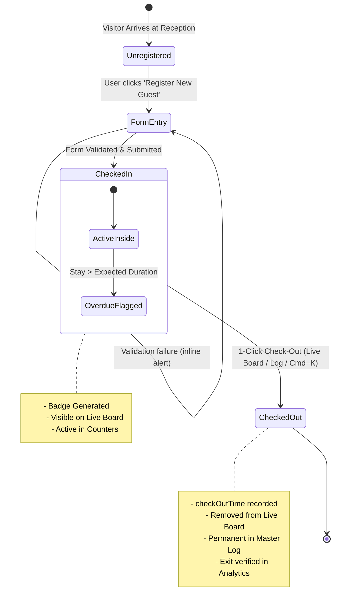

# Comprehensive State Management, Data Models & Business Logic Analysis
**Project**: VSMS PRO — Computerized Guest Information Tracking System  
**Survey Date**: 2026-08-18  
**Investigator**: Explorer 2 (State, Data Models & Business Logic Survey)  
**Target Goal**: Support Redesign into High-Contrast Ultra-Minimalist Black & White Monochrome Interface

---

## 1. Executive Summary

This report provides a comprehensive technical breakdown of the state management architecture, data structures, domain models, business logic rules, state machine transitions, and edge cases across the VSMS application. 

The application is structured as a client-side React 18 + Vite SPA utilizing a unified Context API (`VisitorContext`) with `localStorage` synchronization. It implements 5 core operational domains:
1. **Guest Registration & Verification**: Dynamic cascade forms, validation, and auto-issuance.
2. **Real-time Live Operations Board**: Active visitor presence tracking, duration computation, and 1-click checkout.
3. **Master Audit Log & Data Export**: Multi-predicate filtering, pagination, and RFC 4180-compliant CSV generation.
4. **Printable Digital Badge & QR Engine**: Dynamic QR code generation containing cryptographic-style JSON metadata for exit scanning.
5. **Global Navigation & Command Layer**: Global shortcut-driven (`Cmd+K`) search and fast action invocation.

---

## 2. State Management Architecture (`VisitorContext.jsx`)

### 2.1 Context Store Decomposition

The application centralizes state within `src/context/VisitorContext.jsx`. The state store comprises 11 state variables and 7 primary action handlers:

```mermaid
graph TD
    subgraph Persistent State [LocalStorage Tier]
        LS_V[vsms_visitors] <--> VState[visitors: Visitor[]]
        LS_T[vsms_theme] <--> TState[theme: 'dark' | 'light']
        LS_R[vsms_role] <--> RState[userRole: 'admin' | 'security']
    end

    subgraph Ephemeral UI State
        AVState[activeView: 'live' | 'log' | 'analytics' | 'departments' | 'settings']
        M1[isCheckInOpen: boolean]
        M2[isBadgeModalOpen: boolean]
        M3[isCmdKOpen: boolean]
        M4[selectedVisitorForBadge: Visitor | null]
        F1[globalSearchQuery: string]
        F2[selectedDeptFilter: string]
        F3[selectedStatusFilter: string]
    end

    subgraph Actions & Handlers
        A1[registerVisitor] --> VState
        A2[checkOutVisitor] --> VState
        A3[openBadgeModal] --> M2 & M4
        A4[resetToDemoData] --> VState
        A5[exportToCSV]
        A6[toggleTheme] --> TState
        A7[setUserRole] --> RState
    end
```

### 2.2 Detailed State Dictionary

| State Property | Type | Default Value | Persistence Key | Lifecycle & Sync Trigger |
|---|---|---|---|---|
| `visitors` | `Visitor[]` | `INITIAL_VISITORS` (6 records) | `localStorage['vsms_visitors']` | `useEffect([visitors])` serializes to JSON string |
| `theme` | `'dark' \| 'light'` | `'dark'` | `localStorage['vsms_theme']` | `useEffect([theme])` toggles `dark`/`light` class on `<html>` |
| `userRole` | `'admin' \| 'security'` | `'admin'` | `localStorage['vsms_role']` | `useEffect([userRole])` writes role string |
| `activeView` | `'live' \| 'log' \| 'analytics' \| 'departments' \| 'settings'` | `'live'` | In-memory | Set via Sidebar menu, Command Palette, or Header links |
| `isCheckInOpen` | `boolean` | `false` | In-memory | Triggered by FAB, Cmd+K action, or Live Tracker CTA |
| `isBadgeModalOpen`| `boolean` | `false` | In-memory | Auto-opens after registration or via "View Badge" button |
| `selectedVisitorForBadge` | `Visitor \| null` | `null` | In-memory | Populated during `openBadgeModal(visitor)` or registration |
| `isCmdKOpen` | `boolean` | `false` | In-memory | Toggled by `Cmd+K` / `Ctrl+K` global event listener & `Escape` |
| `globalSearchQuery` | `string` | `''` | In-memory | Two-way bound to Header search bar & Command Palette |
| `selectedDeptFilter` | `string` | `'All'` | In-memory | Controlled by Header and View department filters |
| `selectedStatusFilter`| `string` | `'All'` | In-memory | Controlled by Master Log status dropdown |

---

## 3. Domain Data Models & Schema Specifications

### 3.1 `Visitor` Entity
```typescript
interface Visitor {
  id: string;                      // Unique ID format: "VIS-" + 4 digits (e.g. "VIS-8921")
  fullName: string;                // Full name of the guest (Required)
  phone: string;                   // Phone number format (Required, e.g. "+234 803 555 0192")
  email: string;                   // Contact email (Optional, defaults to "N/A")
  company: string;                 // Company or organization (Optional, defaults to "Private Guest")
  idType: IdTypeEnum;              // Document type from ID_TYPES
  idNumber: string;                // ID serial / card number (Required, e.g. "DL-9940218-B")
  hostName: string;                // Host staff member name (Referenced from HOSTS)
  department: string;              // Department name (Referenced from DEPARTMENTS)
  purpose: VisitPurposeEnum;       // Purpose of visit from VISIT_PURPOSES
  checkInTime: string;             // ISO 8601 UTC timestamp (e.g. "2026-08-18T16:15:00.000Z")
  checkOutTime: string | null;     // ISO 8601 UTC timestamp or null if currently active
  status: 'Checked-In' | 'Overdue' | 'Checked-Out'; // Current visitor operational status
  badgeId: string;                 // Pass serial format: "BDG-" + 3 digits (e.g. "BDG-081")
  expectedDurationMinutes: number; // Scheduled duration: 30, 60, 90, 120, 240, 480
  vehiclePlate: string;            // Vehicle registration (Optional, defaults to "N/A")
  notes: string;                   // Luggage, belongings, or visit remarks
  avatar: string;                  // Image URL (Unsplash or DiceBear SVG fallback)
}
```

### 3.2 `Department` Entity
```typescript
interface Department {
  id: string;                      // Primary Key: "dept-1" .. "dept-6"
  name: string;                    // Full display title (e.g. "Information Technology & Cyber Security")
  code: string;                    // Short uppercase mnemonic (e.g. "ITCS", "EXEC", "HR", "FIN", "LEGAL", "PROC")
  head: string;                    // Name of the department director / lead
  floor: string;                   // Facility physical location (e.g. "Level 3", "Ground Floor")
}
```

### 3.3 `Host` Entity
```typescript
interface Host {
  id: string;                      // Primary Key: "host-1" .. "host-8"
  name: string;                    // Full name of host officer (e.g. "Engr. Marcus Sterling")
  title: string;                   // Professional designation (e.g. "Chief Information Officer")
  deptId: string;                  // Foreign Key referencing Department.id
  email: string;                   // Corporate email (e.g. "m.sterling@org.gov")
}
```

### 3.4 Enumerations & Lookups (`src/data/initialData.js`)

#### `VISIT_PURPOSES`
1. `Official Meeting`
2. `Job Interview`
3. `Contractor / Technical Maintenance`
4. `Document Delivery / Courier`
5. `Regulatory Inspection / Audit`
6. `Personal Visit`
7. `Vendor Presentation`

#### `ID_TYPES`
1. `National Identity Card (NIN)`
2. `Driver’s License`
3. `International Passport`
4. `Voter’s Card`
5. `Corporate Staff ID`

---

## 4. Detailed Business Logic & Feature Workflows

### 4.1 Guest Check-In & Registration Validation (`QuickCheckInModal.jsx`)

#### Step-by-Step Flow:
1. **Modal Initiation**: Triggered via `setIsCheckInOpen(true)`. Form defaults to `ID_TYPES[0]`, `departments[0]`, first host for that department, `VISIT_PURPOSES[0]`, duration `'60'`, and Dicebear/Unsplash avatar seed.
2. **Department-Host Dynamic Cascade**:
   - When the user selects a `department` from the dropdown, `onChange` triggers:
   ```javascript
   const deptObj = departments.find(d => d.name === newDept);
   const firstHost = hosts.find(h => d && h.deptId === d.id)?.name || hosts[0]?.name;
   setFormData({ ...formData, department: newDept, hostName: firstHost });
   ```
   - The host dropdown is dynamically filtered to only display hosts where `h.deptId === deptObj.id`.
3. **Form Validation Logic**:
   - Required fields check:
     - `formData.fullName.trim() !== ''`
     - `formData.phone.trim() !== ''`
     - `formData.idNumber.trim() !== ''`
   - *Current Implementation*: Uses blocking `alert('Please fill in required fields...')`.
   - *Target Improvement*: Non-blocking inline field validation with high-contrast error states and input focus.
4. **Registration Dispatch (`registerVisitor`)**:
   - Generates ID: `VIS-${Math.floor(1000 + Math.random() * 9000)}`.
   - Generates Badge ID: `BDG-${String(visitors.length + 85).padStart(3, '0')}`.
   - Sets `checkInTime = new Date().toISOString()`.
   - Sets `checkOutTime = null`.
   - Sets `status = 'Checked-In'`.
   - Sets `expectedDurationMinutes = parseInt(formData.expectedDurationMinutes || '60', 10)`.
   - Sets `avatar = formData.avatar || https://api.dicebear.com/7.x/initials/svg?seed=...`.
   - Sanitizes defaults for `email` (`'N/A'`), `company` (`'Private Guest'`), `vehiclePlate` (`'N/A'`).
   - Prepends record to `visitors` array: `[newVisitor, ...prev]`.
   - Closes check-in modal (`setIsCheckInOpen(false)`).
   - Fires confetti micro-interaction (needs monochrome particle update).
   - Automatically opens badge pass modal (`setSelectedVisitorForBadge(newVisitor); setIsBadgeModalOpen(true)`).

---

### 4.2 Real-time Live Tracking & 1-Click Checkout (`LiveTrackerView.jsx`)

#### 1. Presence Filter Predicate:
```javascript
const activeVisitors = visitors.filter(v => {
  if (v.status === 'Checked-Out') return false;
  const matchesSearch = !globalSearchQuery || 
    v.fullName.toLowerCase().includes(globalSearchQuery.toLowerCase()) ||
    v.company.toLowerCase().includes(globalSearchQuery.toLowerCase()) ||
    v.hostName.toLowerCase().includes(globalSearchQuery.toLowerCase()) ||
    v.badgeId.toLowerCase().includes(globalSearchQuery.toLowerCase());
  const matchesDept = selectedDeptFilter === 'All' || v.department === selectedDeptFilter;
  return matchesSearch && matchesDept;
});
```

#### 2. Stay Duration Algorithm (`calculateDuration`):
```javascript
const calculateDuration = (checkInTime) => {
  const start = new Date(checkInTime);
  const now = new Date();
  const diffMs = now - start;
  const diffMins = Math.floor(diffMs / (1000 * 60));
  const hours = Math.floor(diffMins / 60);
  const mins = diffMins % 60;
  if (hours > 0) return `${hours}h ${mins}m`;
  return `${mins}m`;
};
```
*Current limitation*: Re-renders only on state change. A 30-second interval ticker should be added to keep elapsed times live.

#### 3. 1-Click Checkout Mechanics:
- User clicks "Check-Out" button on card (or in log table / command palette).
- Calls `checkOutVisitor(v.id)`:
```javascript
setVisitors(prev => prev.map(v => {
  if (v.id === visitorId) {
    return {
      ...v,
      checkOutTime: new Date().toISOString(),
      status: 'Checked-Out'
    };
  }
  return v;
}));
```
- **Instant State Effects**:
  - Visitor immediately vanishes from the Live Operations Board.
  - Active visitor count in Sidebar & Header decrements by 1.
  - Master Log updates status pill from `INSIDE` / `OVERDUE` to `CHECKED-OUT` and records `checkOutTime`.
  - Analytics "Successful Exit Verifications" count increments by 1.

---

### 4.3 Master Visitor Log, Multi-Filter, Pagination & CSV Export (`VisitorLogView.jsx`)

#### 1. Compound Search & Multi-Predicate Filter:
Filters across 3 orthogonal dimensions simultaneously:
1. Text Query (Search input matching `fullName`, `company`, `hostName`, `id`, `badgeId`).
2. Department Filter (`selectedDeptFilter` matching `v.department` or `'All'`).
3. Status Filter (`selectedStatusFilter` matching `v.status` or `'All'`).

#### 2. Client-Side Pagination Mathematics:
- `itemsPerPage = 8`
- `totalPages = Math.ceil(filtered.length / itemsPerPage) || 1`
- `paginatedVisitors = filtered.slice((currentPage - 1) * itemsPerPage, currentPage * itemsPerPage)`
- Nav controls disabled conditionally: `disabled={currentPage === 1}` and `disabled={currentPage === totalPages}`.

#### 3. CSV Data Export Engine:
- Extracts all records from `visitors` array.
- Formats headers and quoted comma-separated fields:
```javascript
const headers = ['Visitor ID', 'Full Name', 'Phone', 'Email', 'Company', 'ID Type', 'ID Number', 'Host', 'Department', 'Purpose', 'Check-In', 'Check-Out', 'Status', 'Badge ID'];
const rows = visitors.map(v => [
  v.id,
  `"${v.fullName.replace(/"/g, '""')}"`,
  `"${v.phone}"`,
  `"${v.email}"`,
  `"${v.company.replace(/"/g, '""')}"`,
  `"${v.idType}"`,
  `"${v.idNumber}"`,
  `"${v.hostName}"`,
  `"${v.department}"`,
  `"${v.purpose}"`,
  `"${new Date(v.checkInTime).toLocaleString()}"`,
  v.checkOutTime ? `"${new Date(v.checkOutTime).toLocaleString()}"` : 'Active',
  v.status,
  v.badgeId
]);
```
- Generates Blob URI / Data URI: `data:text/csv;charset=utf-8,...`.
- Programmatically attaches temporary `<a>` element, triggers download `VSMS_Visitor_Log_YYYY-MM-DD.csv`, and cleans up DOM.

---

### 4.4 Printable Digital Badge & QR Code Generation (`VisitorPassModal.jsx`)

#### 1. QR Payload Specification:
The QR code encodes a structured JSON string containing verifiable metadata:
```json
{
  "badgeId": "BDG-081",
  "visitorId": "VIS-8921",
  "name": "Alexander Wright",
  "host": "Engr. Marcus Sterling",
  "checkIn": "2026-08-18T16:15:00.000Z"
}
```
Rendered via `QRCodeSVG` with error correction `level="M"` and size `76px` / `96px`.

#### 2. Thermal & Paper Print Handling:
- Injected print CSS (`index.css` `@media print`):
```css
@media print {
  body * { visibility: hidden; }
  #printable-badge, #printable-badge * { visibility: visible; }
  #printable-badge {
    position: absolute;
    left: 0;
    top: 0;
    width: 100%;
    margin: 0;
    padding: 20px;
    box-shadow: none !important;
  }
}
```
- Triggered seamlessly via `window.print()`.

---

### 4.5 Command Palette Navigation Layer (`CommandPalette.jsx`)

- Global listener for `e.metaKey || e.ctrlKey` + `'k'` and `'Escape'`.
- Real-time guest lookup matching 5 properties (`fullName`, `company`, `hostName`, `badgeId`, `id`) limited to top 5 results.
- Embedded fast action handlers directly inside the command palette:
  - 1-click Check-Out for active guests.
  - 1-click View Pass modal trigger.
  - View navigation commands to switch `activeView` to `'live'`, `'log'`, `'analytics'`, `'departments'`, `'settings'`, or open check-in modal.

---

## 5. State Transition Lifecycle Machine



### Transition State Table

| Origin State | Trigger / Event | Guard / Condition | Destination State | Side Effects |
|---|---|---|---|---|
| `Unregistered` | Click "Register New Guest" | None | `Modal: CheckIn Open` | Form initialized with defaults |
| `Modal: CheckIn Open` | Submit form | Valid Name, Phone, ID Number | `Checked-In` | Generate VIS ID & BDG ID, prepend to `visitors`, sync `localStorage`, fire confetti, open `VisitorPassModal` |
| `Checked-In` | Elapsed time > duration | `now - checkIn > expectedDuration` | `Overdue` | Display warning status pill, increment Overdue stat |
| `Checked-In` \| `Overdue` | Click "Check-Out" | Visitor ID exists | `Checked-Out` | Set `checkOutTime = now`, status `'Checked-Out'`, sync `localStorage`, decrement active count |
| Any State | Click "Reset Demo Data" | User confirms | `Initial Seed Data` | `visitors` reset to `INITIAL_VISITORS`, `localStorage` cleared |

---

## 6. Comprehensive Edge Cases & Mitigation Matrix

| # | Domain / Feature | Edge Case Scenario | Potential Failure Mode | Recommended Architectural Mitigation |
|---|---|---|---|---|
| 1 | **Registration** | User enters only whitespace for required fields (e.g. `"   "`). | Blank records registered into system. | Use `.trim()` before validation: `if (!name.trim() \|\| !phone.trim() \|\| !idNumber.trim())`. |
| 2 | **Registration** | Browser alerts used on validation error (`alert(...)`). | Jarring, blocking UX on modern displays. | Replace `alert()` with inline field-level validation messages and red/high-contrast input border rings. |
| 3 | **Registration** | Avatar URL fails to load (network error / 404). | Broken image icon shown on cards and badge. | Robust `onError` fallback on all `` tags to fallback DiceBear SVG. |
| 4 | **Registration** | Department switch causes orphaned host. | Selected host does not belong to new department. | Automatically reset `hostName` to first host of selected department upon department change. |
| 5 | **Live Tracker** | User remains on Live Tracker for hours without clicking. | Duration counter remains static at render time. | Implement `useEffect` with `setInterval(..., 30000)` to force periodic re-render of duration timers. |
| 6 | **Live Tracker** | All visitors checked out or filtered out. | Blank/empty screen. | Render clean high-contrast empty state with icon, explanatory message, and "Register New Guest" CTA. |
| 7 | **Master Log** | Filter results yield fewer items than current pagination page (e.g. filtering to 1 result while on page 3). | Table shows empty rows even though matching records exist. | Reset `currentPage = 1` whenever `selectedDeptFilter`, `selectedStatusFilter`, or search query changes. |
| 8 | **Master Log / CSV** | Visitor name or company contains commas, double quotes, or newlines. | Malformed CSV columns when opened in Excel / Sheets. | Escape quotes by replacing `"` with `""` and wrapping fields in quotes (`"${field.replace(/"/g, '""')}"`). |
| 9 | **Badge / QR** | Visitor details contain special unicode characters (accents, apostrophes). | QR scanner or JSON parse fails on exit desk. | Valid UTF-8 encoding in `JSON.stringify` for QR payload. |
| 10 | **Badge / Print** | User triggers print when modal is closed. | Blank print preview. | Print handler only callable when `isBadgeModalOpen === true` and `#printable-badge` is mounted. |
| 11 | **Command Palette** | User presses Down/Up arrows to navigate search results. | Search list currently only supports mouse clicks. | Implement keyboard traversal with `selectedIndex`, arrow listeners, and `Enter` to select. |
| 12 | **Badge ID Collision** | Badge ID calculation uses `visitors.length + 85`. Deleting or filtering may create duplicate IDs. | Duplicate badge IDs in records. | Calculate max existing badge number: `Math.max(...visitors.map(v => parseInt(v.badgeId.replace('BDG-','')) || 0)) + 1`. |

---

## 7. Strategic Recommendations for the Monochrome Redesign

To achieve the strict black & white sans-serif aesthetic mandated in `ORIGINAL_REQUEST.md`, the following logic and token adaptations should be executed by the implementation squad:

1. **Color Token Standardization**:
   - Replace `--openai-accent: #10a37f` (emerald) with high-contrast monochrome tokens:
     - Light Mode: `#000000` (primary fill), `#ffffff` (surface), `#e5e5e5` (crisp border), `#737373` (muted text).
     - Dark Mode: `#ffffff` (primary fill), `#000000` (surface), `#111111` (surface-elevated), `#262626` (crisp border), `#a3a3a3` (muted text).
2. **Status Pill Badge Paradigm**:
   - **`Checked-In` (Inside)**: High-contrast solid pill (`bg-black text-white dark:bg-white dark:text-black font-semibold`) or crisp solid border with active pulse dot.
   - **`Overdue`**: High-contrast inverted double-bordered pill (`border-2 border-black dark:border-white font-bold`) with warning symbol `[!]`.
   - **`Checked-Out`**: Subtle muted outline badge (`border border-neutral-300 dark:border-neutral-700 text-neutral-500 font-normal`).
3. **Confetti Micro-interaction**:
   - Change confetti colors in `VisitorContext.jsx:117` to pure monochrome: `['#000000', '#ffffff', '#737373', '#d4d4d4']`.
4. **Printable Badge Monochrome Layout**:
   - Strip all emerald gradients; use sharp black borders (`border-2 border-black`), clear typographic hierarchy, lanyard hole graphic notch, and black-on-white QR code.
5. **Command Palette & Focus Rings**:
   - Apply sharp `focus:ring-2 focus:ring-black dark:focus:ring-white` with zero blur for clean architectural lines.

---
