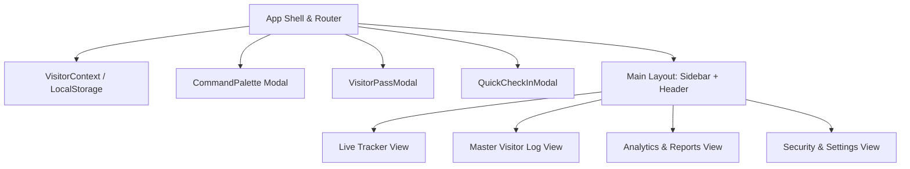

# Architecture & Design System: OpenAI + Material 3 Fusion

## Design System Tokens & Fusion

| Concept | OpenAI Design Ethos | Material 3 (M3) Standard | VSMS Fusion Implementation |
|---|---|---|---|
| **Color Tokens** | Monochromatic graphite (`#09090b`), off-black (`#18181b`), emerald (`#10a37f`) | Dynamic Tonal Surfaces (`surface`, `surface-container`, `primary-container`) | Deep obsidian dark theme with M3 surface elevation tiers and OpenAI emerald/teal accents |
| **Typography** | Inter / Outfit sans-serif, tight tracking, crisp weights | M3 Type Scale (Display, Headline, Title, Body, Label) | High readability sans-serif with M3 font size/line-height hierarchy |
| **Surfaces & Layers** | Minimalist borders, backdrop blur, float menus | M3 State Layers (hover 8%, focus 12%, press 12%), dynamic elevation 0-5 | Glassmorphism navigation with M3 elevation cards and interactive state overlays |
| **Interactions** | Command palette (`Cmd+K`), clean focus rings | Pill chips, FAB (Floating Action Button), M3 modal sheets | Quick `Cmd+K` global search + M3 Pill Filter Chips & FAB Check-In |

## Application Architecture

