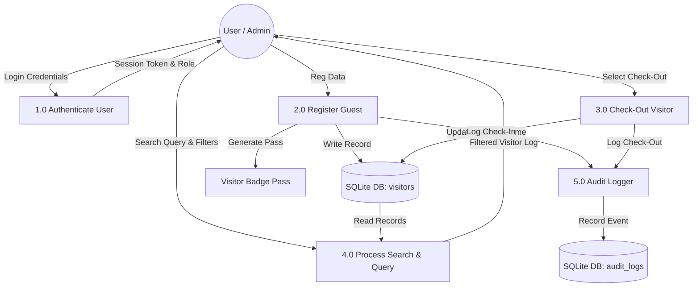

# System Architecture & Technical Design

**Source Document:** [`Computerised.docx`](file:///home/kami/Desktop/codebase/vsms/Computerised.docx) (Section 1.7, Section 3.10 – 3.13)  
**Architecture Model:** 3-Tier Layered Architecture (Presentation Layer, Application Layer, Database Layer)  

---

## 1. High-Level Architectural Overview

The Computerized Guest Information Tracking System (VSMS) adopts a strict **3-Tier Architecture** to isolate user interaction, business logic processing, and relational database persistence.

```
+-----------------------------------------------------------------------+
|                         PRESENTATION LAYER                            |
|  - App Shell & Navigation (Header & Sidebar)                          |
|  - Operational Views: Live Tracker, Visitor Log, Analytics, Settings |
|  - Interactive Modals: Quick Check-In, Visitor Pass Badge, Cmd+K      |
+-----------------------------------------------------------------------+
                                   |
                                   v (Props, State, Context Dispatch)
+-----------------------------------------------------------------------+
|                         APPLICATION LAYER                             |
|  - React Context Store (`VisitorContext.jsx`)                         |
|  - Business Logic & Rules Engine (Duration, Overdue Status, Badges)   |
|  - Authentication & Authorization Handler (`LoginModal.jsx`)          |
|  - CSV Export & Data Validation Engine                              |
+-----------------------------------------------------------------------+
                                   |
                                   v (Async SQL Queries & Persistence)
+-----------------------------------------------------------------------+
|                           DATABASE LAYER                              |
|  - Client-Side SQLite Database Engine (`sql.js` WebAssembly)          |
|  - Relational Schema: users, visitors, departments, hosts, audit_logs|
|  - Binary Serialization & Storage: `vsms_sqlite_db_bin` in LocalStorage|
+-----------------------------------------------------------------------+
```

---

## 2. Tier Details & Responsibilities

### 2.1 Presentation Layer (Section 3.10.1)
The Presentation Layer provides the responsive visual interface for security personnel, receptionists, and administrators.
- **Design System Fusion**: Merges OpenAI minimalist graphite theme (`#000000`, `#111111`, `#18181b`) with Material Design 3 surface elevation tiers and high-contrast typography.
- **Views**:
  - **Live Presence Tracker**: Real-time list of guests currently on-site with live stay timers and overdue status flags.
  - **Master Visitor Log**: Searchable, paginated record table with date, department, and status filters.
  - **Analytics & Dashboard**: Visual metric cards, hourly traffic distribution, and department visit breakdowns.
  - **Department Roster**: Department directory and assigned hosting personnel.
  - **Settings & Security**: System role switcher, database backup export, audit log viewer, and demo data reset.

### 2.2 Application Layer (Section 3.10.2)
The Application Layer processes business logic, enforces validation rules, and manages global state.
- **Global Reactive State (`VisitorContext.jsx`)**: Central hub managing visitor array, active view, search queries, department filters, active modals, and user sessions.
- **ID & Badge Generation**: Algorithmic generation of sequential visitor identifiers (`VIS-1082`) and security badge codes (`BDG-1082`).
- **Duration & Expiry Calculation**: Real-time comparison between entry timestamp (`checkInTime`) and current time to detect overdue visits.
- **Data Validation & Sanitization**: Strict input validation preventing malformed or malicious values from persisting to storage.

### 2.3 Database Layer (Section 3.10.3)
The Database Layer delivers structured relational data storage using WebAssembly SQLite (`sql.js`).
- **Relational Integrity**: Enforces schemas across 5 core tables: `users`, `visitors`, `departments`, `hosts`, and `audit_logs`.
- **Persistence Engine**: Automatically serializes SQLite database binaries to browser `localStorage` under `vsms_sqlite_db_bin`, retaining offline data durability across restarts.

---

## 3. Data Flow Diagrams (DFD)

### 3.1 Context-Level Data Flow Diagram (Level 0 DFD - Section 3.12.1)

```mermaid
graph TD
    Visitor[Visitor / Guest] -->|Provides Reg Info| VSMS System[Computerized Guest Tracking System]
    Officer[Security Officer / Admin] -->|Enters Check-In / Search / Check-Out| VSMS System
    VSMS System -->|Issues Digital Badge & QR Pass| Visitor
    VSMS System -->|Outputs Reports, Logs, Analytics| Officer
```

### 3.2 Level-1 Data Flow Diagram (Decomposed Processes - Section 3.13)



---

## 4. System Functional Modules (Section 3.11)

| Module ID | Module Name | Primary Responsibilities | React Components / Files |
|---|---|---|---|
| **MOD-01** | Authentication | Password validation, role switching, user session management. | `LoginModal.jsx`, `VisitorContext.jsx` |
| **MOD-02** | Guest Registration | Visitor details form, department/host selection, validation. | `QuickCheckInModal.jsx` |
| **MOD-03** | Check-In & Badge Pass | Unique ID assignment, timestamping, QR badge pass render. | `VisitorPassModal.jsx` |
| **MOD-04** | Check-Out | Departure timestamping, stay duration calculation, status update. | `LiveTrackerView.jsx` |
| **MOD-05** | Master Visitor Log | Paginated record listing, multi-field filtering, sorting. | `VisitorLogView.jsx` |
| **MOD-06** | Search | Fast global search across visitors, actions, and navigation. | `CommandPalette.jsx`, `Header.jsx` |
| **MOD-07** | Dashboard & Analytics | Presence counters, overdue alerts, department graphs. | `AnalyticsView.jsx`, `Header.jsx` |
| **MOD-08** | Reporting & Export | RFC-4180 CSV file generation and statistics export. | `VisitorContext.jsx`, `VisitorLogView.jsx` |
| **MOD-09** | Database Service | SQLite schema setup, seed data, storage persistence. | `src/db/sqliteDb.js` |
