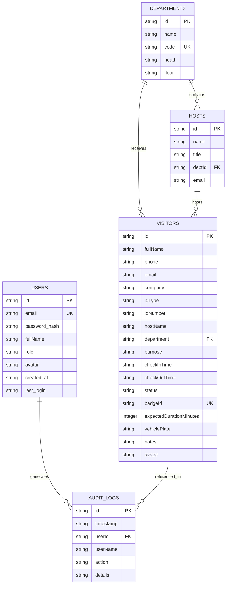

# Relational Database Schema & Entity-Relationship Specifications

**Source Document:** [`Computerised.docx`](file:///home/kami/Desktop/codebase/vsms/Computerised.docx) (Section 3.14, Section 3.15)  
**Database Engine:** SQLite 3 (via `sql.js` WebAssembly + LocalStorage binary persistence)  

---

## 1. Entity-Relationship Diagram (ERD)

---

## 2. Table Specifications

### 2.1 Table: `users` (Administrator & Officer Authentication - Section 3.15 Table 3.1)
Stores authenticated user accounts, roles, and hashed credentials.

| Column Name | Data Type | Constraints | Description |
|---|---|---|---|
| `id` | `TEXT` | `PRIMARY KEY` | Unique User ID (e.g. `USR-001`) |
| `email` | `TEXT` | `UNIQUE`, `NOT NULL` | Administrator email / login handle |
| `password_hash` | `TEXT` | `NOT NULL` | Password hash (plain text prohibited) |
| `fullName` | `TEXT` | `NOT NULL` | Full display name of administrator |
| `role` | `TEXT` | `NOT NULL` | System access role (`admin`, `security`, `reception`) |
| `avatar` | `TEXT` | `NULLABLE` | User avatar image URL |
| `created_at` | `TEXT` | `ISO 8601` | Record creation timestamp |
| `last_login` | `TEXT` | `ISO 8601` | Last successful authentication timestamp |

---

### 2.2 Table: `visitors` (Guest & Visit Records - Section 3.15 Table 3.2 & 3.3)
Combines Visitor profile and Visit activity data into a normalized, single-table view for ultra-fast query execution.

| Column Name | Data Type | Constraints | Description |
|---|---|---|---|
| `id` | `TEXT` | `PRIMARY KEY` | Unique Visitor Record ID (e.g. `VIS-1082`) |
| `fullName` | `TEXT` | `NOT NULL` | Full legal name of the visitor |
| `phone` | `TEXT` | `NULLABLE` | Telephone / mobile contact number |
| `email` | `TEXT` | `NULLABLE` | Email address of the visitor |
| `company` | `TEXT` | `NULLABLE` | Visitor's company or organization |
| `idType` | `TEXT` | `NULLABLE` | Document type (`National ID`, `Passport`, `Driver License`, `Work Permit`) |
| `idNumber` | `TEXT` | `NULLABLE` | Identification document number |
| `hostName` | `TEXT` | `NULLABLE` | Name of the hosting staff member |
| `department` | `TEXT` | `NULLABLE` | Department code (`EXEC`, `ITCS`, `HR`, `FIN`, `LEGAL`, `PROC`) |
| `purpose` | `TEXT` | `NULLABLE` | Stated reason for the visit |
| `checkInTime` | `TEXT` | `NOT NULL` | Arrival ISO 8601 timestamp |
| `checkOutTime` | `TEXT` | `NULLABLE` | Departure ISO 8601 timestamp (NULL if active) |
| `status` | `TEXT` | `NOT NULL` | Visit status (`Checked-In`, `Checked-Out`, `Overdue`) |
| `badgeId` | `TEXT` | `UNIQUE` | Security pass badge ID (e.g. `BDG-1082`) |
| `expectedDurationMinutes` | `INTEGER` | `DEFAULT 60` | Expected stay duration in minutes |
| `vehiclePlate` | `TEXT` | `NULLABLE` | Visitor vehicle license plate number |
| `notes` | `TEXT` | `NULLABLE` | Security notes or special remarks |
| `avatar` | `TEXT` | `NULLABLE` | Visitor photograph or generated avatar URL |

---

### 2.3 Table: `departments` (Organizational Structure)

| Column Name | Data Type | Constraints | Description |
|---|---|---|---|
| `id` | `TEXT` | `PRIMARY KEY` | Department entity ID (e.g. `DEPT-001`) |
| `name` | `TEXT` | `NOT NULL` | Full department name (e.g. `Information Technology & Cyber Security`) |
| `code` | `TEXT` | `UNIQUE`, `NOT NULL` | Department short code (e.g. `ITCS`) |
| `head` | `TEXT` | `NULLABLE` | Head of department name |
| `floor` | `TEXT` | `NULLABLE` | Physical building floor / location |

---

### 2.4 Table: `hosts` (Host Roster)

| Column Name | Data Type | Constraints | Description |
|---|---|---|---|
| `id` | `TEXT` | `PRIMARY KEY` | Host employee ID (e.g. `HST-001`) |
| `name` | `TEXT` | `NOT NULL` | Full name of host officer |
| `title` | `TEXT` | `NULLABLE` | Official job title |
| `deptId` | `TEXT` | `FOREIGN KEY` | Refers to `departments.code` |
| `email` | `TEXT` | `NULLABLE` | Corporate email address |

---

### 2.5 Table: `audit_logs` (Security & Audit Trail)

| Column Name | Data Type | Constraints | Description |
|---|---|---|---|
| `id` | `TEXT` | `PRIMARY KEY` | Unique log entry ID (e.g. `LOG-1726124-492`) |
| `timestamp` | `TEXT` | `NOT NULL` | ISO 8601 event timestamp |
| `userId` | `TEXT` | `NULLABLE` | User ID of the actor |
| `userName` | `TEXT` | `NULLABLE` | Display name of the actor |
| `action` | `TEXT` | `NOT NULL` | Action code (`CHECK_IN`, `CHECK_OUT`, `USER_LOGIN`, `DATA_RESET`) |
| `details` | `TEXT` | `NULLABLE` | Detailed JSON or string payload describing the event |
