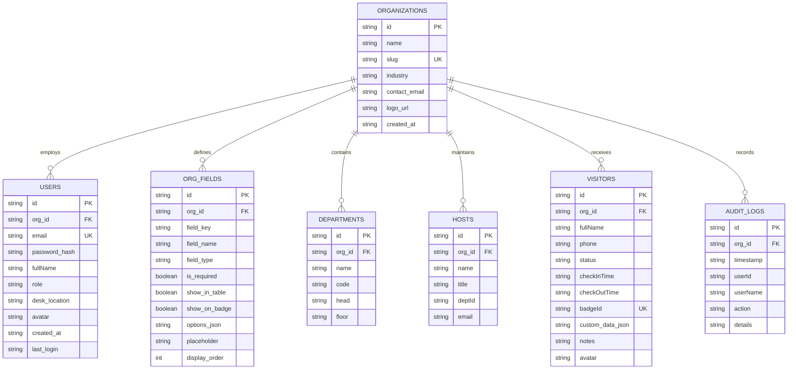

# Relational Database Schema & Multi-Tenant Entity Specifications

**Database Engine:** SQLite 3 (via `sql.js` WebAssembly + LocalStorage binary persistence)  
**Tenancy Model:** Logical isolation via `org_id` foreign keys + resilient JSON-serialized custom fields.

---

## 1. Entity-Relationship Diagram (ERD)

```mermaid
erDiagram
    ORGANIZATIONS ||--o{ USERS : employs
    ORGANIZATIONS ||--o{ ORG_FIELDS : defines
    ORGANIZATIONS ||--o{ DEPARTMENTS : contains
    ORGANIZATIONS ||--o{ HOSTS : maintains
    ORGANIZATIONS ||--o{ VISITORS : receives
    ORGANIZATIONS ||--o{ AUDIT_LOGS : records

    ORGANIZATIONS {
        string id PK
        string name
        string slug UK
        string industry
        string contact_email
        string logo_url
        string created_at
    }

    ORG_FIELDS {
        string id PK
        string org_id FK
        string field_key
        string field_name
        string field_type
        boolean is_required
        boolean show_in_table
        boolean show_on_badge
        string options_json
        string placeholder
        int display_order
    }

    USERS {
        string id PK
        string org_id FK
        string email UK
        string password_hash
        string fullName
        string role
        string desk_location
        string avatar
        string created_at
        string last_login
    }

    VISITORS {
        string id PK
        string org_id FK
        string fullName
        string phone
        string status
        string checkInTime
        string checkOutTime
        string badgeId UK
        string custom_data_json
        string notes
        string avatar
    }

    DEPARTMENTS {
        string id PK
        string org_id FK
        string name
        string code
        string head
        string floor
    }

    HOSTS {
        string id PK
        string org_id FK
        string name
        string title
        string deptId
        string email
    }

    AUDIT_LOGS {
        string id PK
        string org_id FK
        string timestamp
        string userId
        string userName
        string action
        string details
    }
```

---

## 2. Table Specifications

### 2.1 Table: `organizations`
Stores tenant profile and workspace settings.
* `id` (`TEXT PRIMARY KEY`): e.g., `ORG-APEX-01`
* `name` (`TEXT NOT NULL`): Legal organization name
* `slug` (`TEXT UNIQUE NOT NULL`): URL-safe slug
* `industry` (`TEXT`): Corporate, Healthcare, Tech, Government, etc.
* `contact_email` (`TEXT NOT NULL`): Official security/admin contact
* `logo_url` (`TEXT`): Branding logo or generated avatar
* `created_at` (`TEXT NOT NULL`): ISO 8601 timestamp

### 2.2 Table: `organization_fields`
Defines the dynamic schema for visitor registration per organization.
* `id` (`TEXT PRIMARY KEY`): e.g., `FLD-101`
* `org_id` (`TEXT NOT NULL`): Foreign key to `organizations.id`
* `field_key` (`TEXT NOT NULL`): Attribute key (e.g., `company`, `govt_id_number`, `laptop_serial`)
* `field_name` (`TEXT NOT NULL`): Human-readable label (e.g., `Company / Employer`)
* `field_type` (`TEXT NOT NULL`): `text`, `number`, `email`, `select`, `checkbox`, `textarea`, `date`, `photo`, `host_picker`
* `is_required` (`INTEGER NOT NULL`): `1` for required, `0` for optional
* `show_in_table` (`INTEGER NOT NULL`): `1` to show in summary table (max fixed slot count), `0` otherwise
* `show_on_badge` (`INTEGER NOT NULL`): `1` to display on printed visitor pass, `0` otherwise
* `options_json` (`TEXT`): JSON array of strings for `select` dropdown options (or null)
* `placeholder` (`TEXT`): Input placeholder text
* `display_order` (`INTEGER NOT NULL`): Sequence order in registration form

### 2.3 Table: `users`
Accounts assigned to an organization.
* `id` (`TEXT PRIMARY KEY`): e.g., `USR-001`
* `org_id` (`TEXT NOT NULL`): Foreign key to `organizations.id`
* `email` (`TEXT UNIQUE NOT NULL`): User login handle
* `password_hash` (`TEXT NOT NULL`): Plain text / hash
* `fullName` (`TEXT NOT NULL`): Full display name
* `role` (`TEXT NOT NULL`): `admin` or `reception`
* `desk_location` (`TEXT`): Assigned front-desk terminal (e.g. `Main Lobby - Desk A`)
* `avatar` (`TEXT`): Avatar image URL
* `created_at` (`TEXT NOT NULL`): ISO 8601
* `last_login` (`TEXT`): ISO 8601

### 2.4 Table: `visitors`
Visitor check-in logs. Standard fields are `fullName` and `phone`. All organization-configured custom fields are stored in `custom_data_json`.
* `id` (`TEXT PRIMARY KEY`): e.g., `VIS-1082`
* `org_id` (`TEXT NOT NULL`): Foreign key to `organizations.id`
* `fullName` (`TEXT NOT NULL`): Full legal name of visitor (Baseline)
* `phone` (`TEXT NOT NULL`): Mobile contact number (Baseline)
* `status` (`TEXT NOT NULL`): `Checked-In`, `Checked-Out`, `Overdue`
* `checkInTime` (`TEXT NOT NULL`): Arrival ISO 8601
* `checkOutTime` (`TEXT`): Departure ISO 8601 (NULL if active)
* `badgeId` (`TEXT UNIQUE`): Issued security badge code
* `custom_data_json` (`TEXT`): Serialized JSON key-value map of all custom field answers
* `notes` (`TEXT`): General remarks or flags
* `avatar` (`TEXT`): Photo snapshot URL
